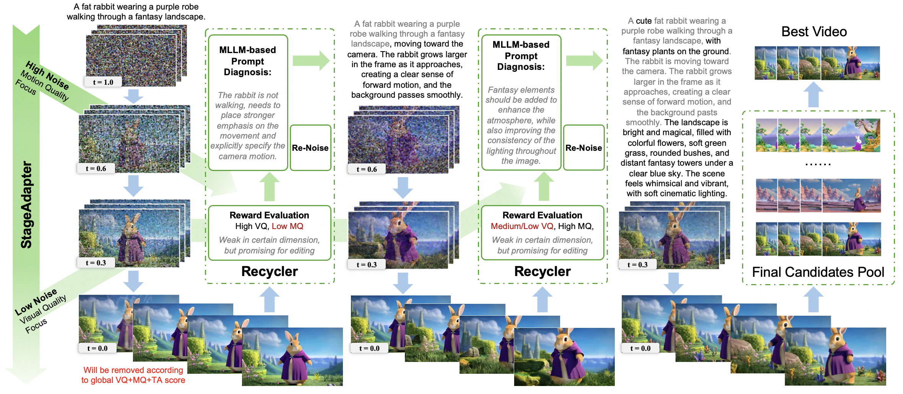

<div align="center">

# From Generation to Editing: Test-Time Scaling for Video Generation via Stage-Aware Candidate Recycling 


<p align="center">  
    <a href="https://hangzhouhe.com/">Hangzhou He</a>,
    <a href="https://scholar.google.com/citations?user=VZbOk2MAAAAJ&hl=en">Lunhao Duan</a>,
    <a href="https://scholar.google.com.hk/citations?user=TFp72vEAAAAJ&hl=zh-CN">Shanshan Zhao♯</a>,
    Kaiwen Li,
    <a href="https://scholar.google.com/citations?user=GlqRHLcAAAAJ">Qing-Guo Chen</a>,
    <a href="https://scholar.google.com/citations?user=tsKl9GUAAAAJ">Weihua Luo</a>,
    <a href="https://scholar.google.com/citations?user=WSFToOMAAAAJ">Yanye Lu♯</a>
</p>

<p>Peking University, Alibaba Group</p>
<p><strong>SIGGRAPH ASIA 2026 & TOG | </strong> <a href="https://arxiv.org/abs/2511.07222"><strong>Paper</strong></a></p>

</div>

## Introduction
This is the implementation of GEARS(**G**uided **E**diting for **A**daptive **R**ecycling **S**earch) from paper "From Generation to Editing: Test-Time Scaling for Video Generation via Stage-Aware Candidate Recycling". GEARS is a test-time scaling framework that improves text-to-video generation by turning low-scoring yet structurally plausible candidates into editable priors instead of discarding them after evaluation. GEARS consists of two components:
1.  StageAdapter uses multi-dimensional reward feedback to route candidates and schedules motion and coarse-structure correction at high-noise stages while refining appearance and details at low-noise stages.
2. Recycler then leverages a multimodal language model to diagnose recoverable failures, generate candidate-specific repair prompts, and perform manifold-aware latent editing before returning the repaired candidates to the search pool.




## Quick Start

The code was tested with Python 3.10.20, PyTorch 2.7.0 with
CUDA 12.8, Transformers 5.3.0, Diffusers 0.37.0 and Flash-Attn 2.7.3. We have also modified the
VideoAlign codebase to to match with the transformers version.

Download the following resources:

1. A [Wan2.1](https://github.com/Wan-Video/Wan2.1) checkpoint, such as `Wan2.1-T2V-1.3B` or
   `Wan2.1-T2V-14B`.
2. The [VideoReward](https://github.com/KwaiVGI/VideoAlign) checkpoint.
3. The standard [Vbench](https://github.com/Vchitect/VBench) prompts arranged as one text file per category. Each
   non-empty line must contain one prompt.

Enter API key, endpoint, and generation configs in
`run_wan_gears_vbench.sh` then run the script.

## Acknowledgements

We thank the authors of [Wan2.1](https://github.com/Wan-Video/Wan2.1), [VideoReward](https://github.com/KwaiVGI/VideoAlign), [EvoSearch](https://github.com/tinnerhrhe/EvoSearch-codes), and [Vbench](https://github.com/Vchitect/VBench) for their open-source contributions.

## Citation

If you find GEARS useful for your research, please consider citing:

```bibtex
@article{he2026gears,
  title     = {From Generation to Editing: Test-Time Scaling for Video Generation via Stage-Aware Candidate Recycling},
  author    = {He, Hangzhou and Duan, Lunhao and Zhao, Shanshan and Li, Kaiwen and Chen, Qing-Guo and Luo, Weihua and Lu, Yanye},
  journal   = {ACM Transactions on Graphics},
  year      = {2025},
  note      = {SIGGRAPH Asia 2026},
}
```
